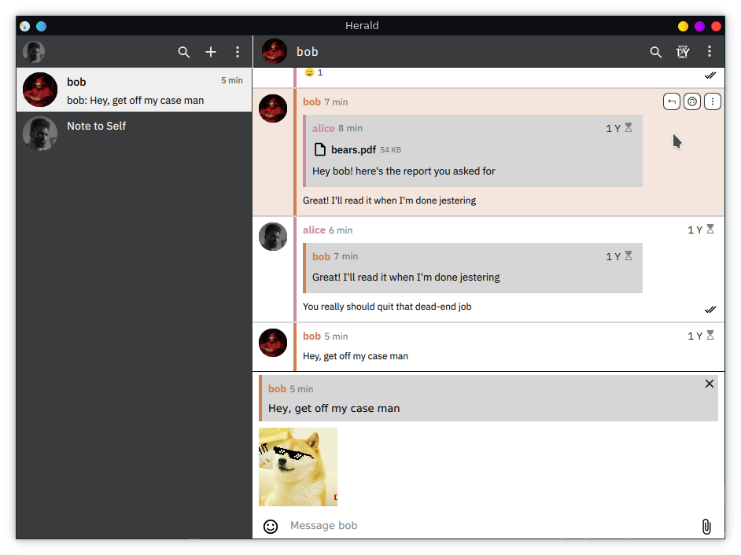

# herald
A cross-platform end-to-end encrypted instant messenger.

This project is currently pre-alpha and under active development.

Build instructions for various platforms can be found on the
[project wiki](https://github.com/kalix-systems/herald/wiki/Building-Herald).

Autogenerated documentation for the rust portions of the project can be built
using [`rustdoc`](https://doc.rust-lang.org/rustdoc/index.html).
